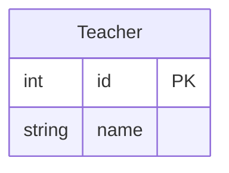
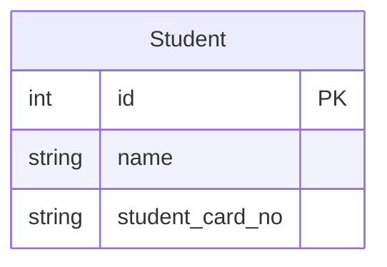
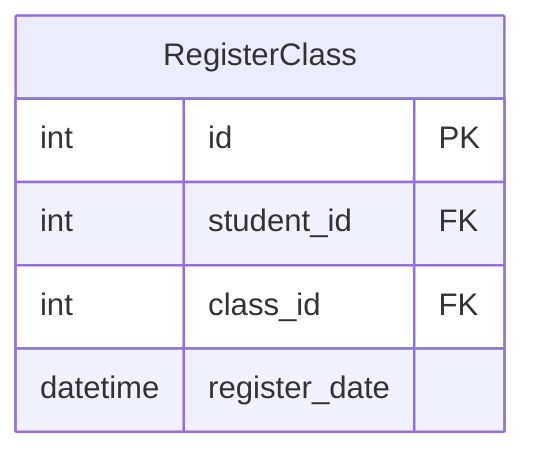

## I. Tool
Mermaid xây dựng sẵn một live editor online cho việc edit diagram as realtime nên chúng ta có thể sử dụng trực tiếp ở đường dẫn sau [Live Editor](https://mermaid.live/edit)

Hoặc có thể sử dụng trực tiếp mermaid markdown note trực tiếp ở markdown file như sau. Việc này khá tương tự với việc markdown code block thay vì dùng ngôn ngữ code như `js`, `ruby` ta có thể dùng ngôn ngữ `mermaid`
```
```mermaid
```


## II. Khai báo loại diagram
Trong mermaid sẽ có khá nhiều loại **diagrams** như `sequence, class, flow, etc ...`. Ở bài viết này chúng ta chỉ tập trung vào **Sequence Diagram**. 

Sử dụng syntax **ER Diagram** ở đầu dòng sẽ giúp mermaid hiểu chúng ta đang muốn render **ER Diagram** và sẽ parse syntax cho diagram đó
```
erDiagram
```

## III. Ứng dụng thực tế
Bài toán đưa ra là thiết kế một database cho một trường đại học. Với những yêu cầu như sau
- Mỗi lớp học bắt buộc có duy nhất một giáo viên giảng dạy. Và có thể có thêm một trợ giảng
- Các sinh viên của trường đại học sẽ đăng kí lớp học và tối đa 5 lớp học cho một kì
- Mỗi lớp học sẽ có tối đa sinh viên từ 10 tới 30 sinh viên

## IV. Khai báo các Entity hoặc Model
Từ yêu cầu phía trên ta cần có các entity sau:
- Giảng viên
- Sinh viên
- Lớp học
- Đăng kí lớp học

### Syntax để tạo ra một entity or model sẽ như sau
```
(Tên model) {
	(Kiểu dữ liệu) (Tên Column) (Thuộc tính đặc biệt như khóa ngoại, unique key | Không bắt buộc)
}
```


### Entity Giảng Viên
Trước hết chúng ta cùng thiết kế entity cho Giảng Viên. Ở đây chúng ta thiết kế khá đơn giản chỉ bao gồm id là khóa chính và tên của giảng viên
```
erDiagram

Teacher {
  int id PK
  string name
}
```


### Entity Sinh Viên
Ở đây chúng ta cũng thiết kế khá đơn giản chỉ bao gồm id là khóa chính, tên của sinh viên và số thẻ sinh viên
```
erDiagram

Student {
  int id PK
  string name
  string student_card_no
}
```



### Entity Lớp học
Thiết kế lớp học chúng ta sẽ chú ý hai yêu cầu sau
- Mỗi lớp học bắt buộc có duy nhất một giáo viên giảng dạy. Và có thể có thêm một trợ giảng
- Mỗi lớp học sẽ có tối đa sinh viên từ 10 tới 30 sinh viên
Như vậy chúng ta sẽ có hai khóa ngoại là `teach_id` và `sub_teacher_id` đại diện cho giảng viên giảng dạy và trợ giảng. Và ta có thêm column `max_students` để đại diện cho số sinh viên tối đa của lớp đó
```
erDiagram

Class {
  int id PK
  int teacher_id FK
  int sub_teacher_id "Optional" FK
  string name
  int max_students "Constraint Range in 10 - 30"
}
```

```mermaid
erDiagram

Class {
  int id PK
  int teacher_id FK
  int sub_teacher_id FK "Optional"
  string name
  int max_students "Constraint Range in 10 - 30"
}
```

### Entity Đăng kí lớp học
Đăng kí lớp học là một bảng trung gian để thể hiện sinh viên theo học lớp học nào. Ở đây chúng ta thêm một trường datetime để lưu lại ngày đăng kí khóa học

```
erDiagram

RegisterClass {
  int id PK
  int student_id FK
  int class_id FK
  datetime register_date
}
```



## V. Khai báo mối quan hệ giữa các entity hoặc model
### Syntax
Trước hết ta cùng đi qua syntax quan hệ
```
(first-entity) (relationship) (second-entity) : (relationship-label)
```

Relationship thì syntax như nào. Chúng ta cùng xem một bảng syntax sau

|Bên Trái |Bên phải | Ý Nghĩa|
|---|---|---|
| \|o | o\| | Không hoặc một|
| \|\| | \|\| | Chính xác một|
| }o | o{ | Không hoặc nhiều|
| }\| | \|{ | Một hoặc nhiều|

Ví dụ lớp học entity có một hoặc nhiều học sinh. Và học sinh có một hoặc nhiều lớp học
```
erDiagram

class }|--|{ Student :has many
```

## Thiết kế theo yêu cầu
### Yêu cầu 1
**Mỗi lớp học bắt buộc có duy nhất một giáo viên giảng dạy. Và có thể có thêm một trợ giảng**

Như vậy phân tích ra thì một lớp học có chính xác một giảng viên và không hoặc một trợ giảng. Bổ sung một giáo viên cũng có thể giảng viên chính cho nhiều lớp học

```
erDiagram

Teacher {
  int id PK
  string name
}

Class {
  int id PK
  int teacher_id FK
  int sub_teacher_id FK "Optional"
  string name
  int max_students "Constraint Range in 10 - 30"
}

Class }|--|| Teacher :main_teacher
Class }o--o| Teacher :sub_teacher
```

```mermaid
erDiagram

Teacher {
  int id PK
  string name
}

Class {
  int id PK
  int teacher_id FK
  int sub_teacher_id FK "Optional" 
  string name
  int max_students "Constraint Range in 10 - 30"
}

Class }|--|| Teacher :main_teacher
Class }o--o| Teacher :sub_teacher
```

### Yêu cầu 2
**Các sinh viên của trường đại học sẽ đăng kí lớp học và tối đa 5 lớp học cho một kì**

Để đơn giản bài toán ta sẽ không đi sâu vào xử lý tối đa 5 lớp học vì phần này sẽ thiết kế ở application layer

Như vậy phân tích ra thì một sinh viên sẽ có thể đăng kí nhiều lớp học và một lớp học sẽ có thể có nhiều sinh viên (Ta kết nối thông qua entity trung gian đăng kí lớp học). Lưu ý ở đây sinh viên phải đăng kí ít nhất một lớp học 

```
erDiagram

Teacher {
  int id PK
  string name
}

Student {
  int id PK
  string name
  string student_card_no
}

Class {
  int id PK
  int teacher_id FK
  int sub_teacher_id FK "Optional"
  string name
  int max_students "Constraint Range in 10 - 30"
}

RegisterClass {
  int id PK
  int student_id FK
  int class_id FK
  datetime register_date
}

Class }|--|| Teacher :main_teacher
Class }o--o| Teacher :sub_teacher

Student }|--|} RegisterClass :register_class
Class }|--|} RegisterClass :has_many_student_through_register
```

```mermaid
erDiagram

Teacher {
  int id PK
  string name
}

Student {
  int id PK
  string name
  string student_card_no
}

Class {
  int id PK
  int teacher_id FK
  int sub_teacher_id FK "Optional"
  string name
  int max_students "Constraint Range in 10 - 30"
}

RegisterClass {
  int id PK
  int student_id FK
  int class_id FK
  datetime register_date
}

Class }|--|| Teacher :main_teacher
Class }o--o| Teacher :sub_teacher

Student }|--|{ RegisterClass :register_class
Class }|--|{ RegisterClass :has_many_student_through_register
```

### Yêu cầu 3
**Mỗi lớp học sẽ có tối đa sinh viên từ 10 tới 30 sinh viên**

Chúng ta đã thiết kế khi tạo entity class với cột `max_students`. Việc còn lại chúng ta có thể tạo constraint trong database hoặc handle ở application layer (Chúng ta sẽ không đi sâu trong diagram)
