## I. Tool
Mermaid xây dựng sẵn một live editor online cho việc edit diagram as realtime nên chúng ta có thể sử dụng trực tiếp ở đường dẫn sau [Live Editor](https://mermaid.live/edit)

Hoặc có thể sử dụng trực tiếp mermaid markdown note trực tiếp ở markdown file như sau. Việc này khá tương tự với việc markdown code block thay vì dùng ngôn ngữ code như `js`, `ruby` ta có thể dùng ngôn ngữ `mermaid`
```
```mermaid
```

## II. Khai báo loại diagram
Trong mermaid sẽ có khá nhiều loại **diagrams** như `sequence, class, flow, etc ...`. Ở bài viết này chúng ta chỉ tập trung vào **Sequence Diagram**. 

Sử dụng syntax **Sequence Diagram** ở đầu dòng sẽ giúp mermaid hiểu chúng ta đang muốn render **Sequence Diagram** và sẽ parse syntax cho diagram đó
```
sequenceDiagram
```

## III. Khai báo các bên tham gia

Khi làm với **Sequence Diagram** chúng ta thường phân tích requirement và đưa ra những bên liên quan trong hệ thống như user, server, database, etc...

Mermaid hỗ trợ chúng ta 2 bên tham gia chính là **Actor** và **Participant**

### Actor
Để đại diện cho phía client side ta dùng syntax như ví dụ ở dưới
```
sequenceDiagram
	actor User
	actor MobileApp
	actor ReactApp
```
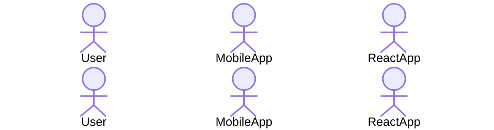
### Participant
Để đại diện cho service ở phía server ta dùng syntax như ví dụ ở dưới
```
sequenceDiagram
	participant Server
	participant AuthService
	participant Message Queue
```

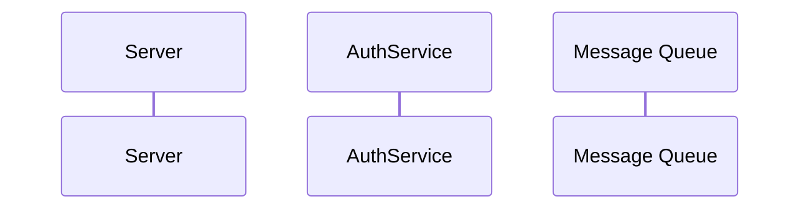
### Alias
Đối với một participant có naming khá dài ta có thể dùng alias để thể hiện participant
Format
```
(actor or participant) (Alias kí tự) as (Tên bên tham gia)

participant Message Queue as MQ
```


## IV. Khai báo liên kết giữa các bên tham gia
### Cách khai báo
Để khai báo liên kết giữa các bên tham gia ta cần hai yếu tố chính
- Mũi tên quan hệ (Arrow)
- Thông điệp quan hệ (Message)

Format sẽ như sau: 
```
(Bên Tham Gia or Alias) (Mũi tên Quan Hệ): (Thông điệp quan hệ)

User ->> Server: Call Login API
```

Ví dụ
```
sequenceDiagram	
	actor U as User
	participant S as Server
	
	U ->> S :Call Login API
	S -->> U :Send back Token
```

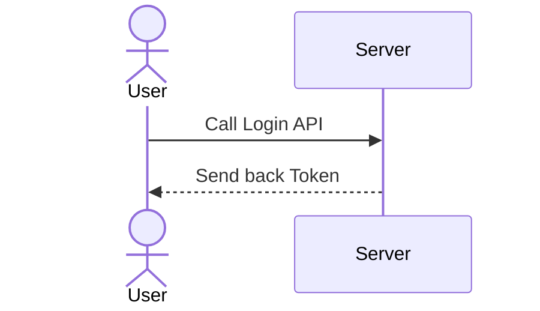

### Quy ước chung
Sẽ có một số quy ước chung nhất định được thầm hiểu khi vẽ **Sequence Diagram**
#### 1. Request Arrow (Synchronous)
Ta nên dùng mũi tên quan hệ như sau để thể hiện một request từ bên A tới bên B `->>`

Ví dụ
```
sequenceDiagram
	participant A
	participant B
	
	A ->> B :Call service B
```

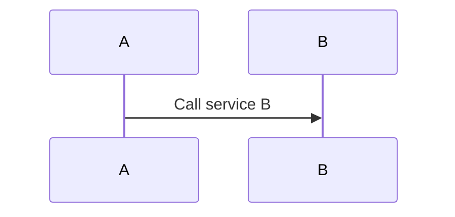
#### 2. Response Arrow  (Synchronous)
Ta nên dùng mũi tên quan hệ như sau để thể hiện một response từ bên B gửi về A `-->>`

Ví dụ

```
sequenceDiagram
	participant A
	participant B
	
	A ->> B :Call service B
	B -->> A :Received message from A
```

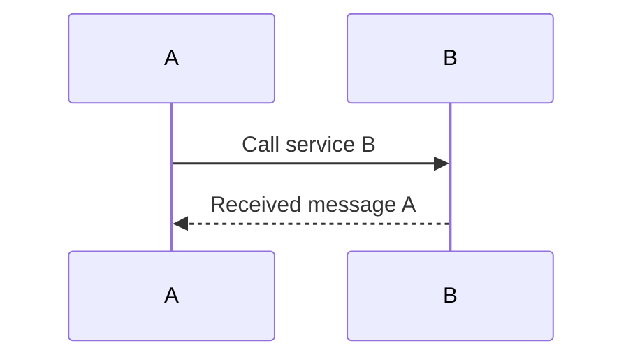
#### 3. Request Arrow (Asynchronous)
Đa số request thường là đồng bộ (synchronous) trong trường hợp bất động bộ (Asynchronous) ta có thể dùng mũi tên quan hệ sau để thể hiện `--)`

Ví dụ
```
sequenceDiagram
	participant Server
	participant Queue Message
	
	Server --) Queue Message :Send messsage user signup to topic queue
```

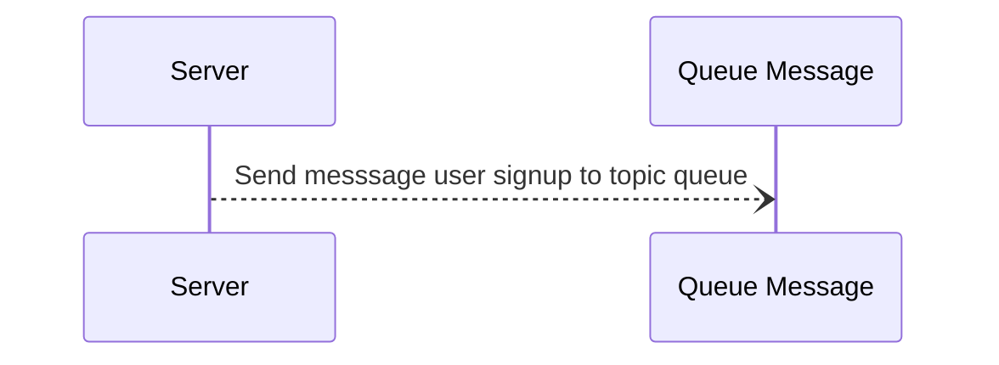

### Trường hợp đặc biệt
#### 1. Thể hiện logic loop trong diagram
Để thể hiện logic loop ta có syntax khá đặc biệt là `loop`. Được dùng trong trường hợp chúng ta muốn thể hiện một sự kiện lặp đi lặp lại có thể xem ở ví dụ dưới

```
sequenceDiagram
	participant Server
	participant Queue Message
	
	Server ->> Server :Get All User
	
	loop 
		Server ->> Server :Check Active Users
	end
	
	Server --) Queue Message :Send Active Users List to Welcome Email Topic
```

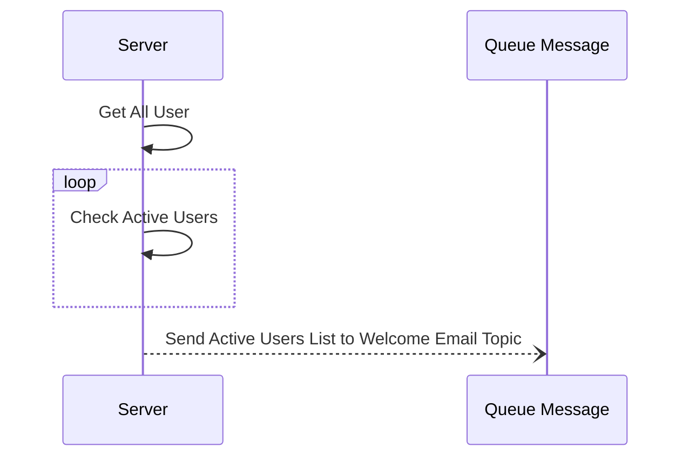
#### 2. Thể hiện thời gian xử lý của một request
Để thể hiện thời gian xử lý một request trực quan cho người sử dụng diagram. Ta có thể sử dụng hai kiểu syntax chính sau
##### 1. `activate` `deactivate`
Ví dụ ở trường hợp này ta activate khi server handle signup request từ client cho tới lúc trả về request

```
sequenceDiagram
	actor User
	participant Server
	
	User ->> Server :Signup User with Email
	
	activate Server
		Server ->> Server :Check User exist with Email
		Server ->> Server :Create User
		Server -->> User :Succesfully created User
	deactivate Server
```


##### 2.  `+` `-`
Tương tự ví dụ trên ta có thể thay đổi syntax thay vì dùng `activate` ta có thể đánh dấu dựa vào mũi tên quan hệ. Đặt dấu `+`  sau mũi tên quan hệ khi bắt đầu xử lý và dấu `-` sau mũi tên quan hệ khi kết thúc xử lý
```
sequenceDiagram
	actor User
	participant Server
	
	User ->>+ Server :Signup User with Email
	
	Server ->> Server :Check User exist with Email
	Server ->> Server :Create User
	Server -->>- User :Succesfully created User
```

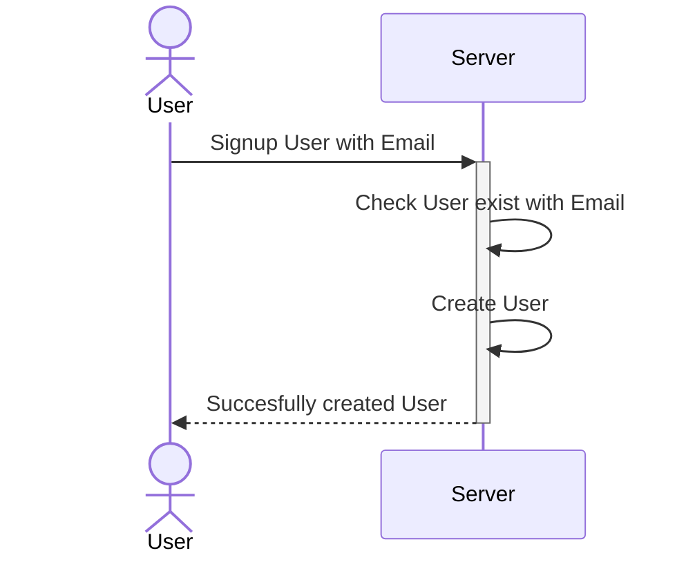

## V. Những tính năng khác
### Note một message

Ta có thể note một thông tin nào đó bên cạnh một flow (ở đây là một request or response). Sử dụng format
```
Note (Vị trí) of (Bên Tham Gia) :(Message)

Note Left of Server :Logging Message
```

Ví dụ
```
sequenceDiagram
	actor User
	participant Server

	User ->> Server :Create User
	Note right of Server :Logging Request 
 	Server -->> :Succesfully created User
```

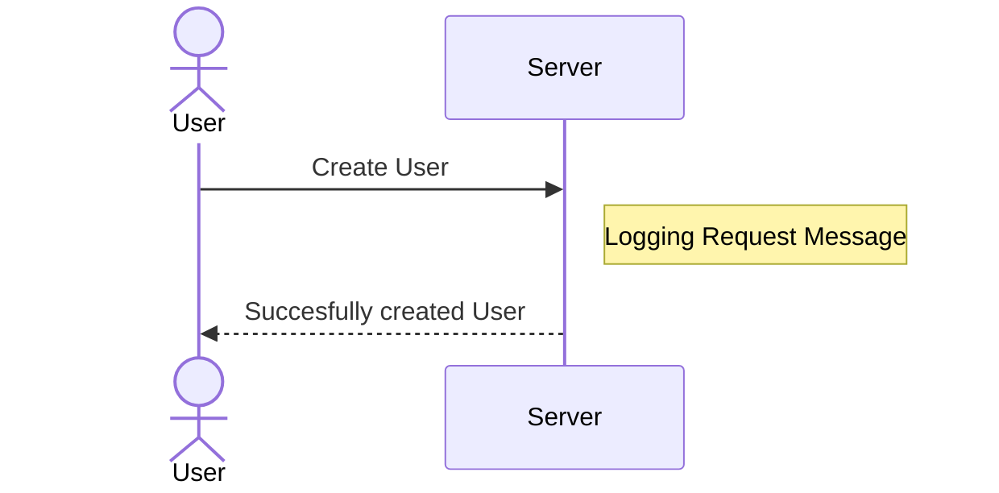

### Đặt tiêu đề cho diagram

Đặt tiêu đề có thể áp dụng cho mọi loại diagram khác nhau. Dùng syntax `title`

```
---
title: Signup Flow
---

sequenceDiagram
	actor User
	participant Server
	
	User ->>+ Server :Signup User with Email
	
	Server ->> Server :Check User exist with Email
	Server ->> Server :Create User
	Server -->>- User :Succesfully created User

```

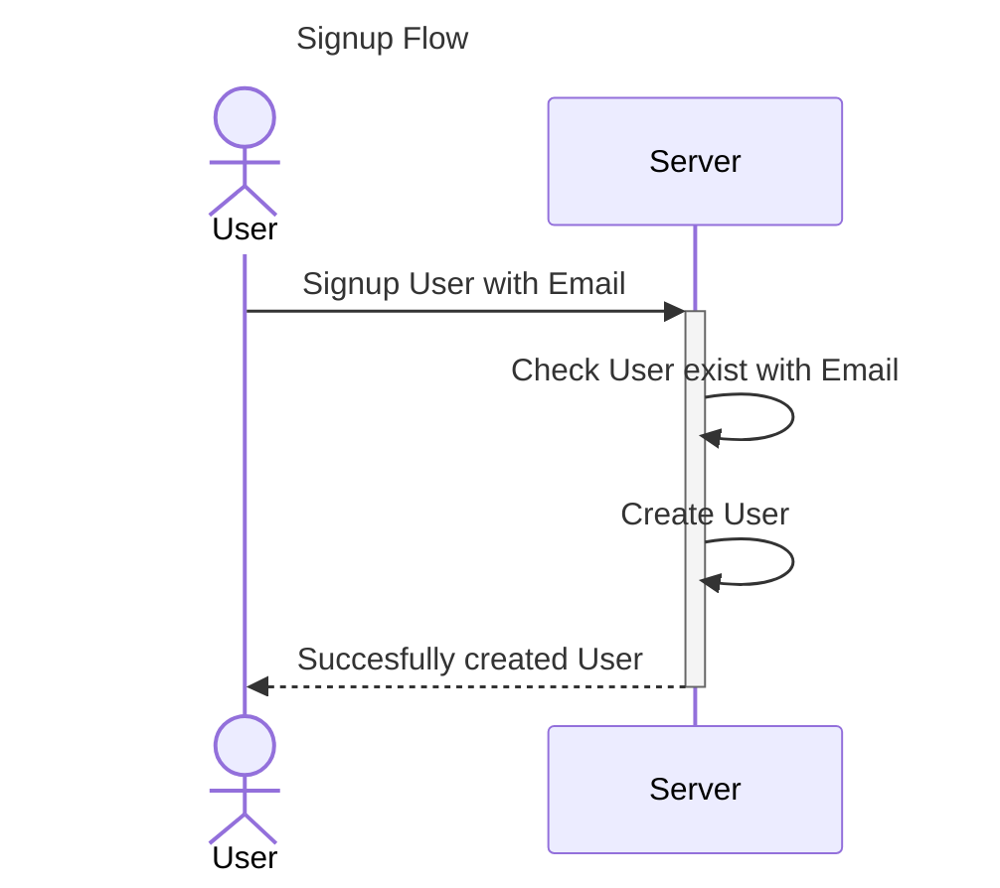

### Đánh số thứ tự cho flow
Ta có thể đánh số thứ tự cho flow cho những digram phức tạp. Để người dùng có thể tracking từng bước của một flow. Dùng syntax `autonumber`

```
---
title: Signup Flow
---

sequenceDiagram
	autonumber

	actor User
	participant Server
	
	User ->>+ Server :Signup User with Email
	
	Server ->> Server :Check User exist with Email
	Server ->> Server :Create User
	Server -->>- User :Succesfully created User
```


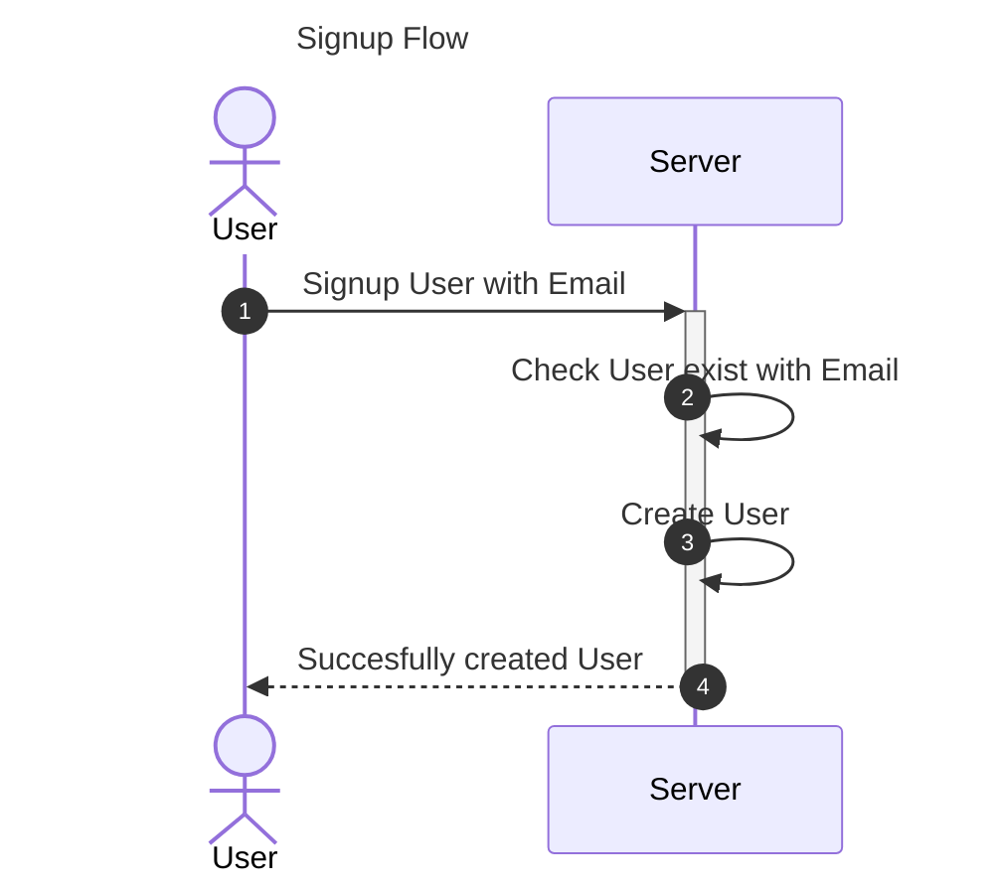